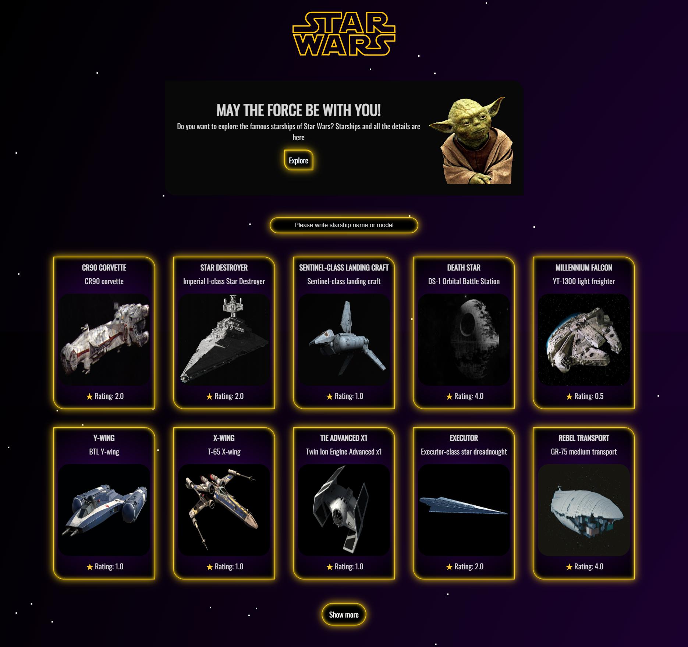

# Star Wars Starships Project

In the project, you can see starships in Star Wars movies.

In the project directory, you can run:

### `npm start`

## Demo

https://starwars-starships-45.netlify.app

## API Usage

In the project, all datas is taken from [Star Wars API (SWAPI)](https://swapi.dev)

## Components

    1. Header
       - This component includes header element and starwars logo.
    2. Home
        - This component is root page of application.
    3. LandingPage
        - This component describes the site information to user.
    4. Shipcard
        - This component is showing starship information on a card. For example name,model, etc. 
    5. Shipdetail
        - This component is showing every detail of selected ship.
    6. Shiplist
        - This component is listing all starships from API.

  
## Ekran Görüntüleri

  
